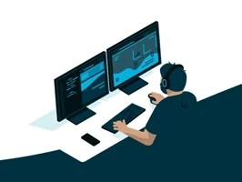

> [!NOTE]\
> `whoami`
> IAM *@Dev.ADAMAS*

### *hi   there, l'm `Dev_ADAMAS`.*

  ## A *Junior* Full-Stack Web Developer
Building `Secured` and `Simple` `aesthetic` `user friendly` `web applications`, for **businesses**, **individuals** and or **organisations**

### What I Do 🤔 ?

  
<b>👨‍🏫 Teaching</b>

  

    My First Role As A Full-Stack Developer, Involves Teaching And Coaching Newbies
      And cordinate trainings sessions that prepares participants for tech roles.
  

  
<b>:copilot: Open Source Contributor</b>

  

    I support open source initiatives, and therefore, am available for an open for public projects. 
  

  
<b>☕ Software Developer</b>

  

     Currently, ama full-stack developer specialing in web applications developement.
    
   
  

## 🧰 Stacks
> [!NOTE]
> This Are The List Of My Current Stacks

## Technologies&Softwares

### Front-End(FE)
- `VSCODE Editor`
- `POSTMAN`
- `Chrome`

### Back-End(BE)
- `XAMPP`
- `Composer`
- `Nodejs`
- `Expressjs`
- `Laravel`
### Other
- `VCS`
- `Git`
- `Github`
- `Bitbucket`
- `Gitlab`

  
